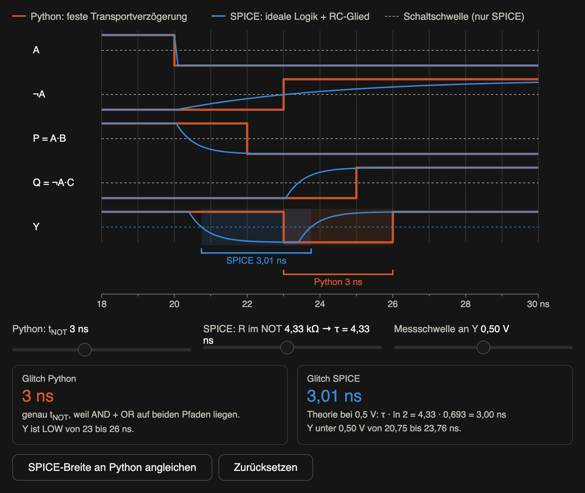
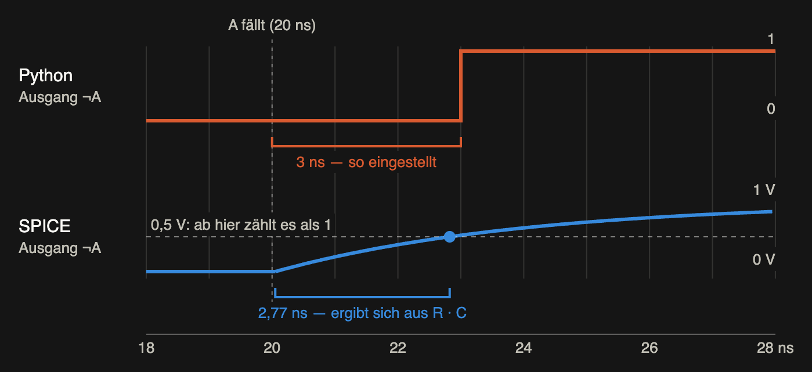

# Day 10: Timing, Glitches and Hazards

## What I understood

I really understand hazards and glitches well now. I can clearly tell the difference between contamination delay (`t_cd`) and propagation delay (`t_pd`) . I also know when I should add an extra path (the redundant consensus term) and when I should not.

I am getting more and more confident with Karnaugh maps.

## My circuit

The image below was exported directly from my saved Digital file. It is a snapshot of the file at the time of this write-up.

[Digital file](praxis/4d.dig)

In the expression below, `!` means NOT, `*` means AND, and `+` means OR. The circuit implements `Y = A * B + !A * C + B * C`. The third AND gate (`B * C`) is the extra path that keeps the output at 1 when A changes while B and C stay at 1.

The saved circuit was checked against all eight input combinations using Digital, and every row matched the expression. The check was run on a temporary copy, so the saved file itself was not changed.

## Python and ngspice waveforms

The first plot simulates what the glitch at Y would look like if the two delay values were set equal.

The second plot shows the output of NOT A. The difference is that ngspice calculates how long it takes until the capacitor is at least half charged, while in Python I simply set the delay value myself. That is why the glitch has a different width in the two models.

## Model limitations

The ngspice circuit is not CMOS, because no real transistors are used in it. Because of that, I cannot predict how real gates would behave.

## Open questions and review

What I find especially difficult right now is visualizing with Python and rebuilding the circuit in ngspice myself. I cannot yet confidently bridge the gap between a logic-gate circuit and an ngspice circuit.
