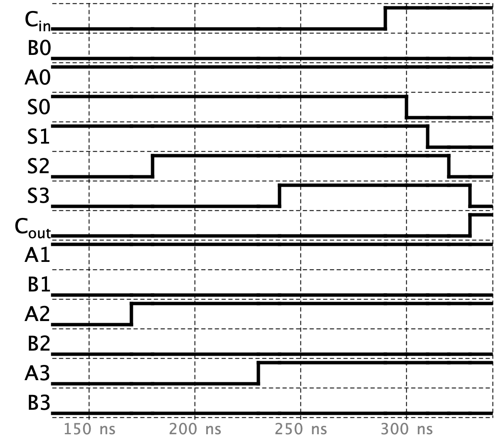
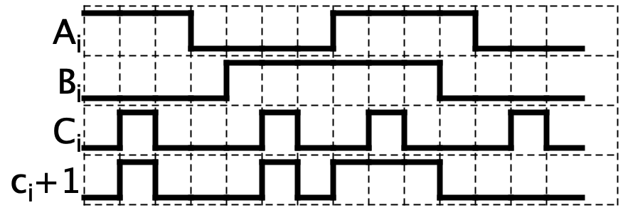
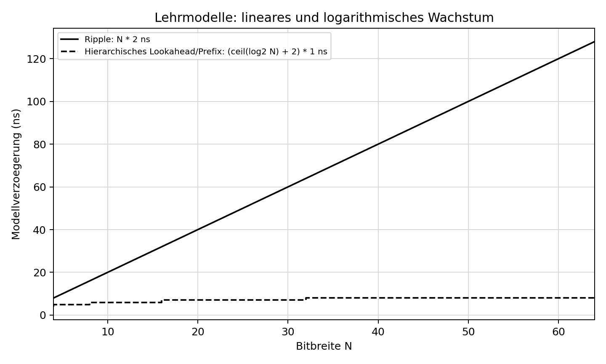

# Day 11: Adders and Carry Delay

Status: completed for the Day 11 learning goals. The detailed prefix hierarchy remains an open topic for later practice.

## What I learned

I understand what a half adder and a full adder are and what the difference is. I can draw both and build them in Digital. A half adder adds two bits. A full adder also includes an incoming carry.

I learned what a ripple-carry adder is and how it works. I also understand why it takes time: the carry moves from the least significant bit towards the most significant bit, and each stage adds a delay.

I know what Generate and Propagate mean and how they are calculated. For this day, I used:

```text
G_i = A_i * B_i
P_i = A_i + B_i
c_(i+1) = G_i + P_i * c_i
```

Here, `*` means AND and `+` means OR. Generate produces a carry when both input bits are 1. Propagate describes whether an incoming carry can pass through the bit position.

I learned to follow a carry through an addition and explain whether there is a carry-out or signed overflow. Carry-out and signed overflow are separate checks. In signed addition, overflow occurs when two inputs with the same sign produce a stored result with the opposite sign.

## My circuits and results

The circuit pictures below were exported from my saved Digital files.

### Full adder

I built the full adder with two XOR gates, two AND gates and one OR gate. It has the inputs `A`, `B` and `C_in`, and the outputs `S` and `C_out`.

[Digital circuit: volladdierer.dig](praxis/schaltungen/volladdierer.dig)


### Four-bit ripple-carry adder

I connected four built-in one-bit `Add` blocks in Digital. Each carry output connects to the next block's carry input. I built the gate-level full adder separately in the file above.

[Digital circuit: ripple4.dig](praxis/schaltungen/ripple4.dig)




Near the end of this graph, `A = 1111` and `B = 0000` are stable. When `C_in` changes from 0 to 1 at about 290 ns, the sum bits change one after another. `C_out` changes at about 330 ns. The carry takes about 40 ns to pass through all four blocks in this simulation, with 10 ns per built-in `Add` block. The final result is `C_out = 1` and `S = 0000`.

### Generate and Propagate

I built the carry equation using AND and OR gates. This circuit exposes the next carry, `c_i+1`; Generate and Propagate are internal signals.

[Digital circuit: Gen_Prop.dig](praxis/schaltungen/Gen_Prop.dig)




The graph shows the three carry behaviours: `00` stops the carry, `01` and `10` pass the incoming carry, and `11` generates a carry regardless of the incoming value.

### Earlier adder experiments

[Digital circuit: adder.dig](praxis/schaltungen/adder.dig)


This file contains separate sum and carry experiments, followed by another full-adder arrangement. In the separate experiments, `X` is an independent input. It is connected internally as `A XOR B` in my completed `volladdierer.dig`.

The experiment file has two independent inputs labelled `C_in`. Digital's external Testcase rejects this duplicate label. The two controls were therefore checked separately through Digital's native simulation model.

### Automated checks

The full adder, ripple adder and Generate/Propagate circuit were checked with Python-generated test cases in Digital. The experiment file used the separate native-model check described above. These checks cover the stable logic results; the timing graphs are recorded separately.

| Circuit or function | Input combinations / checks | Result | Text output |
| --- | ---: | --- | --- |
| Full adder | 8 | Passed | [volladdierer_test.txt](praxis/results/volladdierer_test.txt) |
| Four-bit ripple-carry adder | 512 | Passed | [ripple4_test.txt](praxis/results/ripple4_test.txt) |
| Generate/Propagate carry circuit | 8 | Passed | [Gen_Prop_test.txt](praxis/results/Gen_Prop_test.txt) |
| Separate adder experiments | 1,024 physical input combinations | Passed through the native model; external Testcase blocked by duplicate labels | [adder_test.txt](praxis/results/adder_test.txt) |
| My two Python delay functions | 12 | Passed | [delay_test.txt](praxis/results/delay_test.txt) |

The full-adder and ripple checks can be repeated with [pruefe_schaltungen.py](praxis/pruefe_schaltungen.py). The delay functions are checked with [pruefe_delay.py](praxis/pruefe_delay.py).

## Python delay models

I completed the two functions in [delay_lernen.py](praxis/delay_lernen.py) with help. The plot was generated from these functions using the provided [plot_delay.py](praxis/plot_delay.py). I still need help with Python and do not yet write this kind of program independently.



| Width | Ripple model | Hierarchical lookahead / prefix model |
| ---: | ---: | ---: |
| 4 bits | 8 ns | 4 ns |
| 12 bits | 24 ns | 6 ns |
| 32 bits | 64 ns | 7 ns |
| 64 bits | 128 ns | 8 ns |

The Python-generated values are saved in [delay_werte.txt](praxis/results/delay_werte.txt).

The ripple model assumes 2 ns per full-adder stage: `N * 2 ns`. The hierarchical model assumes 1 ns per model stage: `(ceil(log2(N)) + 2) * 1 ns`. These are learning models, not measured hardware delays. They use different assumptions from the Digital timing graph above.

The ripple delay grows linearly with the bit width. The hierarchical model grows logarithmically. The function name `delay_cla` refers to this hierarchical model here. A chain of fixed-size carry-lookahead blocks still grows linearly as more blocks are added.

## What still needs practice

The prefix hierarchy is still very difficult for me when working on carry-lookahead adders. I can follow the carry equations for individual bits, but combining whole groups is not yet clear to me. I am leaving the detailed group calculations open until Week 9, when prefix adders become a practical task in the plan.

I also still solve the Python tasks with a lot of help. Careless mistakes are a familiar problem: I want to calculate too quickly and sometimes overlook essential rules.

Prioritisation is another thing I need to improve. I spent about one and a half days trying to understand the prefix hierarchy and fell further behind my schedule. I did not stop to ask how important this detail was for the current day, or whether I should move it to a point where I can use it practically and understand its purpose better.

Next time, I want to check the actual learning goal earlier and set a clearer stopping point. I can finish the required work and keep a difficult detail open for later, instead of trying to understand every part immediately.
